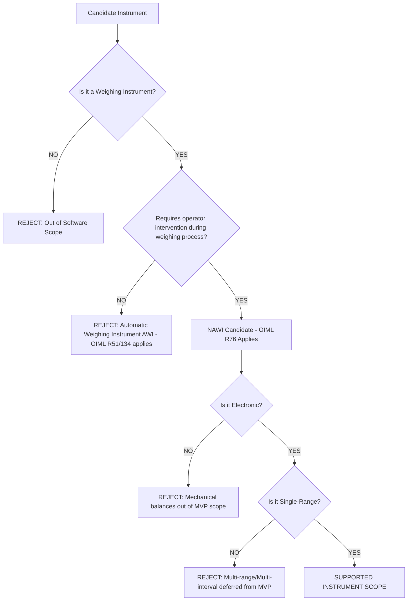

# Instrument Scope Matrix & Classification Decision Tree

## 1. NAWI Classification Decision Tree

Before an instrument can be processed through this software engine, its domain classification must be explicitly verified.

*(Note: Decision criteria sourced from OIML R 76-1:2006, Clause T.1.1 and T.1.2)*

## 2. Active MVP Instrument Scope Matrix

Only instruments meeting the precise definition rules mapped below are eligible for compliance processing in Phase 1 MVP.

| Category ID | Name | Description | Applicable Standard | Initial MVP Scope | Conditions | Limitations | Phase Status |
| :--- | :--- | :--- | :--- | :--- | :--- | :--- | :--- |
| **INST-E-SR-I** | Electronic Single-Range Class I | Special accuracy electronic scale | OIML R 76-1 | YES | Requires specific validation of verification interval `e` | N/A | VERIFIED |
| **INST-E-SR-II** | Electronic Single-Range Class II | High accuracy electronic scale | OIML R 76-1 | YES | Normal standard laboratory temp | Temperature variance deferred | VERIFIED |
| **INST-E-SR-III** | Electronic Single-Range Class III | Medium accuracy electronic scale | OIML R 76-1 | YES | Most common retail/industrial type | N/A | VERIFIED |
| **INST-E-SR-IIII** | Electronic Single-Range Class IIII | Ordinary accuracy electronic scale | OIML R 76-1 | YES | N/A | N/A | VERIFIED |

## 3. Explicitly Excluded (Deferred) Categories

| Category ID | Name | Reason for Exclusion / Deferral | Status |
| :--- | :--- | :--- | :--- |
| **INST-E-MI** | Electronic Multi-interval | Mathematical complexity of shifting `e` ($e_1, e_2$) | INFERRED: Defer to post-MVP |
| **INST-M-SR** | Mechanical Single-Range | Lack of digital error testing via $\Delta L$; visual interpolation | INFERRED: Excluded |
| **INST-AWI** | Automatic Weighing Instrument | Governed by OIML R51/R134. Out of NAWI domain. | VERIFIED: Excluded |
